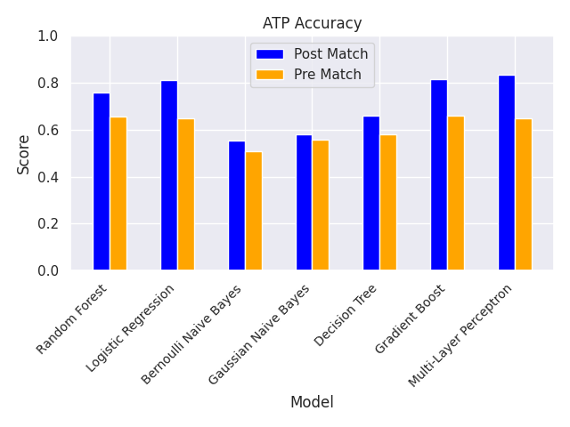
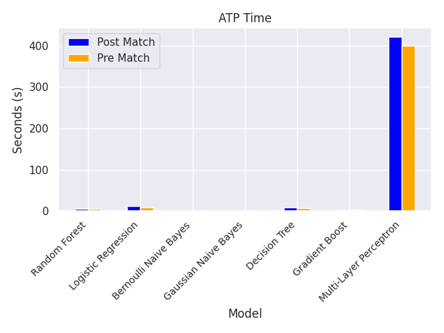
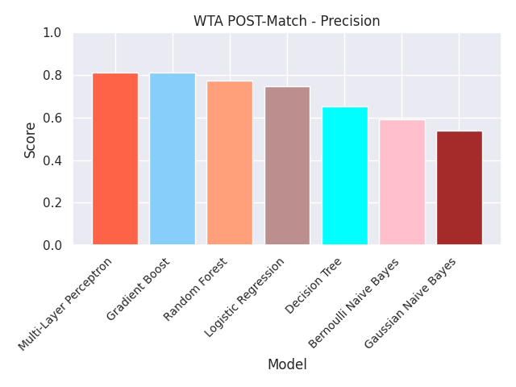
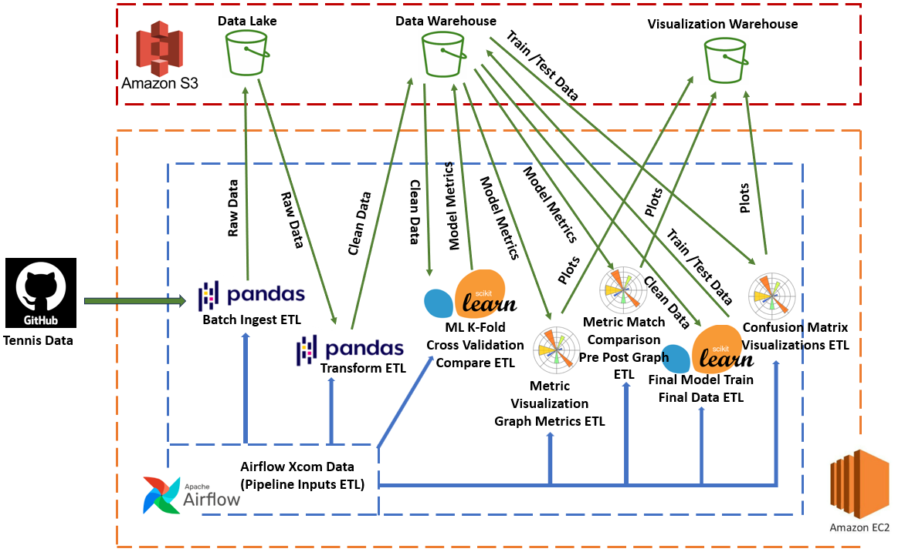

# Historical Tennis Match Predictions - Machine Learning Data Pipeline
Demonstrating the ability to automate ETL processes in AWS utilizing EC2, S3 and Airflow.

## Objective
The goal of the project is to examine different Machine Learning Models and their effectiveness in predicting ATP (Men's) and WTA (Women's) match results.  Models will be created both from player data pre-match as well as from data after match completed.  This will provide insight into whether tennis match results can be predicted based on players rankings and biometrics (pre-match data) or if in-match performance (post-match data) regardless of player ranking has a greater affect on being able to predict match results.  Included in the predictions will be feature importance from the dataset.  This will help determine what metrics within the match have the highest impact on whether a player will win or not.  This will help any tennis player whether amateur or professional determine what aspects they should focus on in training to increase their likelihood of winning.

## Dataset
Historical Match data will be ingested from [Jeff Sackmann's](https://github.com/JeffSackmann) github repository.  The schema for both [ATP](https://github.com/JeffSackmann/tennis_atp) and [WTA](https://github.com/JeffSackmann/tennis_wta) data is the same, providing for singular pre-processing steps for both Men and Women's matches.  The time frame selected was from the year 1989 to present time.  The table schema and explanation of data represented in each column can be seen [here](https://github.com/JeffSackmann/tennis_atp/blob/master/matches_data_dictionary.txt).

### Pre-Processing
Machine Learning Models require training and test data to be input in a form with no null values and all numeric values.  The following pre-processing steps formatted the dataset in the proper format using python's Pandas library.

**Dropping Columns**

The distinction between post-match and pre-match data was executed by removing specific columns from the dataset for each prediction case.  The data schema was manually reviewed, and it was determined which values were irrelevant to both pre and post-match predictions.  Match data including aces, double faults, service points, service games etc were removed from the pre-match prediction data.  Also, columns where the winner could easily be determined from the match were dropped from post match data as well as pre match data.  These include break point faced and 1st serve points won.  The player that loses always faces more break points and the player that wins more 1st serve points always wins.  The model would not be representative in their predictions and would be too biased.

>**Irrelevant columns dropped from both pre and post match data:**
>
>tourney_id', 'tourney_name', 'tourney_date', 'tourney_level', 'match_num', 'winner_name', 'loser_name', 'winner_entry', 'winner_seed', 'winner_ioc', 'loser_ioc', 'loser_seed', 'loser_entry', 'score', 'loser_rank', 'winner_rank'

>**Post Match columns dropped causing bias in model predictions (not included in either dataset):**
>
>'l_bpFaced', 'w_bpFaced', 'w_1stWon', 'l_1stWon'

>**Columns dropped from post match only:**
>
>'winner_rank_points',  'loser_rank_points'

>**Columns dropped from pre match only (post match data):**
>
>'minutes', 'w_ace', 'w_df', 'w_svpt', 'w_1stIn','w_2ndWon', 'w_SvGms', 'w_bpSaved', 'l_ace', 'l_df', 'l_svpt', 'l_1stIn', 'l_2ndWon', 'l_SvGms', 'l_bpSaved'

**Handling Null Values**

Machine Learning Models cannot have any Null Values.  Rows with null values were dropped from the entire dataset except for biometric data (height and age) in which imputation was performed.  Null values for these columns were replaced with the average over the entire dataset.

**Removing Winner and Loser**

All the columns in the dataset are already based on the outcome of the match, winner and loser.  This is what is trying to be predicted.  It is not an acceptable format for our models and needs to be changed.  To account for this glaring issue, a random set of indexes was selected from 50% of the dataset.  New columns player 0 and player 1 were created for each of the winner and loser variables.  For the 50% of random indexes, Winner column values were copied over to player 0 column values and loser values were copied over to player 1 columns.  A new match winner column was created and assigned a value of 0 representing player 0 was the winner. For the indexes not selected randomly, the opposite was done.  Winner column values were copied to player 1 columns.  Loser column values were copied to player 0 and the match winner values entered is now 1 as player 1 is now the winner for the 50% of data indexes.  The tables below show the implementation of this method in a small subset of data.

** Note Schema Not Representative of actual data set schema.  For demonstration purposes only.

| Index | Winner         | Winner_Ace | Winner_DF | Loser              | Loser_Ace | Loser_DF |
|-------|----------------|------------|-----------|--------------------|-----------|----------|
| 1     | Janik Sinner   | 12         | 15        | Ben Shelton        | 13        | 25       |
| 2     | Novak Djokovic | 23         | 8         | Daniil Medvedev    | 12        | 18       |
| 3     | Carlos Alcaraz | 18         | 6         | Stefanos Tsitsipas | 16        | 12       |
| 4     | Tommy Paul     | 19         | 8         | Taylor Fritz       | 8         | 19       |
| 5     | Casper Ruud    | 18         | 10        | Alexander Zverev   | 11        | 21       |
| 6     | Andrey Rublev  | 21         | 20        | Frances Tiafoe     | 5         | 23       |

Indexes 2, 3 and 6 were randomly selected to assign winner values to player 0 and loser values to player 1 resulting in:

| Index | Player_0       | Player_0_Ace | Player_0_DF | Player_1           | Player_1_Ace | Player_1_DF | Match_Winner |
|-------|----------------|--------------|-------------|--------------------|--------------|-------------|--------------|
| 2     | Novak Djokovic | 23           | 8           | Daniil Medvedev    | 12           | 18          | 0            |
| 3     | Carlos Alcaraz | 18           | 6           | Stefanos Tsitsipas | 16           | 12          | 0            |
| 6     | Andrey Rublev  | 21           | 20          | Frances Tiafoe     | 5            | 23          | 0            |

The remaining indexes 1, 4, and 5 assigned winner values to player 1 and loser values to player 0.

| Index | Player_0         | Player_0_Ace | Player_0_DF | Player_1     | Player_1_Ace | Player_1_DF | Match_Winner |
|-------|------------------|--------------|-------------|--------------|--------------|-------------|--------------|
| 1     | Ben Shelton      | 13           | 25          | Janik Sinner | 12           | 15          | 1            |
| 4     | Taylor Fritz     | 8            | 19          | Tommy Paul   | 19           | 8           | 1            |
| 5     | Alexander Zverev | 11           | 21          | Casper Ruud  | 18           | 10          | 1            |

This now creates a perfectly balanced final data set with a random organization of player 1 winners and player 0 winners.  There is no bias between player 1 winners and player 0 winners.

| Index | Player_0         | Player_0_Ace | Player_0_DF | Player_1           | Player_1_Ace | Player_1_DF | Match_Winner |
|-------|------------------|--------------|-------------|--------------------|--------------|-------------|--------------|
| 1     | Ben Shelton      | 13           | 25          | Janik Sinner       | 12           | 15          | 1            |
| 2     | Novak Djokovic   | 23           | 8           | Daniil Medvedev    | 12           | 18          | 0            |
| 3     | Carlos Alcaraz   | 18           | 6           | Stefanos Tsitsipas | 16           | 12          | 0            |
| 4     | Taylor Fritz     | 8            | 19          | Tommy Paul         | 19           | 8           | 1            |
| 5     | Alexander Zverev | 11           | 21          | Casper Ruud        | 18           | 10          | 1            |
| 6     | Andrey Rublev    | 21           | 20          | Frances Tiafoe     | 5            | 23          | 0            |

**One-Hot Encoding**

One-Hot Encoding was performed on all columns that have non-numeric values to ensure the data passed into models only has numeric values.
>Columns that were One-Hot Encoded:
>
>'surface', 'draw_size', 'p0_hand', 'p1_hand', 'round'

**Data Transformation Summary**

The below values summarize the transformations taken on the raw data ingested.  The WTA data can be seen to have a lot more null values in the post match data set and the models will may not be as accurate accordingly.
WTA raw data started at over 93,000 instances and was reduced to just under 21,000 instances.  Further investigation and data cleaning is required to handle the null values in the dataset.

Initial raw data shape:

ATP - Instances: 108950, Features: 49

WTA - Instances: 93030, Features: 49

Pre Match Clean Data Shape:

ATP - Instances: 104424, Features: 49

WTA - Instances: 86902, Features: 53

Post Match Clean Data Shape:

ATP - Instances: 94904, Features: 61

WTA - Instances: 20992, Features: 55

## Model Building
The Machine Learning problem is a binary classification problem where the prediction is trying to identify the match winner.  Either Player 0 or Player 1.  There a multiple classification models that can be examined to help find which 
model is best and find the best.  The following classification models were selected to inspect prediction results and find the most accurate model.  
<ol>
  <li>Multi-Layer Perceptron (Neural Network)</li>
  <li>Logistice Regression</li>
  <li>Random Forest</li>
  <li>Decision Tree</li>
  <li>Gradient Boost</li>
  <li>Gaussian Naive Bayes</li>
  <li>Bernoulli Naive Bayes</li>
</ol>

All models are from the Sci-kit learn python library except for the Gradient Boost which is from the XGBoost library.

### Model Metrics
The six machine learning models are ready to be trained with the tennis data.  The data is separated from its features and target (match_winner) variables.  The features data is normalized using sci-kit learn minMaxScaler so all feature values are in the same
range and prevent any feature biases being created based on ranges of values in a feature.   Larger scales in a feature have the ability to introduce a bias when training a model.  Using minMaxScaler prevents this.

K-Fold Cross Validation was then used on each of the datasets and each of the models using 5 splits.  This provides an accurate represenation of the data using different portions of the data set.  Averaging the results of the model metrics (accuracy, precision,
recall, F1) we can see the overall prediction results and see which models are most accurate.  Pre and Post match data can also be compared as seen below.  All metric plots and comparison plots can be found in the [Outputs](https://github.com/timsj12/Tennis_Match_Predictions/tree/master/Outputs) 
section of this repo under their appropriate tour and directory.

**ATP Model [Accuracy Comparison](Outputs/ATP/PRE_POST_COMPARISON/atp_metric_pre_post_comparison_Accuracy.png)**

The results above show that post match data models are better at predicting match results.  This result is obvious and is expected.  The pre-match results have less data to train on and are only taking into 
account player biometrics, court surface, tournament round and player rank.  Of the models, Multi-Layer Perceptron, Logistic Regression and Gradient Boost performed the best.  While both Naive Bayes and Decision Tree did not perform as well.  Naive Bayes is 
generally considered a "quick and dirty" model for getting the model to run and get an initial result.  Features are not correlated to each other so the Naive Bayes being the least accurate is not surprising.

Surprisingly, none of the models are able to predict player winner by greater than 82% accuracy.  Further statistical analysis and feature engineering would need to be done to create more accurate models in both the
pre match and post match datasets.  Other methods to be used for improvements will be discussed later.

**ATP Model [Time Comparison](Outputs/ATP/PRE_POST_COMPARISON/atp_metric_pre_post_comparison_Time.png)**

Model Completion Time is also an interesting metric to observe.  Multi-Layer Peceptron Model building took significantly more time to train than all the other combined.  Though it was the most accurate model it is a draw back when 
using neural networks as the model transfers data back and forth between each layer in the network and between each of the nodes.  Surprisingly the second most accurate model, Gradient Boost was the third fastest model behind the two Naive Bayes Models.
In terms of performance and accuracy this would be the best model to use for this data set.  It is accurate and fast.

Individual Results for each data set and model are available in their directory within the Metrics/Visualizations sub-directory of each of the datasets.

Example:

**WTA Post Match [Precision](Outputs/WTA/POST_MATCH/METRICS/VISUALIZATIONS/wta_post_match_Precision.png)**

### Final Model Predictions
Once each model is evaluated and overall metrics averaged the efficacy of each model is known and the final model can be trained and utilized using the entire dataset.  5% of the datasets were selected as the test
portion and the rest were utilized for training.  Each model was again fit and the results were output in a confusion matrices which can be seen in the /Models/Visualization directories in the Output directory for each of the tours.  

The confusion matrix confirms the results of the K-Fold metrics generated and the actual number of predicted and actual values for each model can be seen.  Note the scales of the different models are different for each model confusion matrices.

**ATP Pre-Match [Multi-Layer Perceptron (Neural Network)](Outputs/ATP/PRE_MATCH/MODELS/atp_pre_Multi-Layer%20Perceptron_Results_Matrix.png)**

The MLP model was the most accurate model for pre-match data.  About the same number of player 1 and player 0 were correctly predicted as winners.

**ATP Pre-Match [Gaussian Naive Bayes](Outputs/ATP/PRE_MATCH/MODELS/atp_pre_Gaussian%20Naive%20Bayes_Results_Matrix.png)**

The Gaussian Naive Bayes was not accurate in the pre-match predictions.  It only predicted player 1 winners accurately while player 0 winner predictions were highly innacurate.

**ATP Pre-Match [Most Important Features](Outputs/ATP/PRE_MATCH/MODELS/atp_pre_match_RF_Top_Features.png) (Random Forest Generated)**

Player ranking had the most significant impact of predicting which player would win in the ATP Pre-Match Dataset.  This makes sense as the player presumed to be better would have a higher ranking.  Age was the second most important feature followed by
player id and player height.  Surface and tournament round did not have much of an impact on the models.

**ATP Post-Match [Most Important Features](Outputs/ATP/POST_MATCH/MODELS/atp_post_match_RF_Top_Features.png) (Random Forest Generated)**

The post match dataset had more features.  The Importance of the features was more evenly distributed among the top features possibly indicating why the models were more accurate.  A better relationship between the features and the match winner could be built.
2nd serve points won, break points saved, aces, number of serve points and 1st serve In were the top features.  All of these features are critical to winning a tennis match and would represent a good estimate of which player would win.  Still it is of note that
none of the models were able to predict the winner with greater than 82% accuracy.

## Data Pipeline Infrastructure

The airflow instance was hosted on an Amazon EC2 instance.  Data Lake and Data Warehouse storage was handled by Amazon S3.  Visualization .png storage was also handled by Amazon S3.  The [Outputs](Outputs) directory is in the same structure and contains all the same files
as when all the airflow tasks are completed.

The [dag.py](src/dag.py) file contains 8 tasks which combined create the data pipeline.  All tasks are dependent on the previous one and run in order once the previous task has been completed.  The list of tasks in order are:

<ol>
  <li>pipeline_inputs_etl - Set which tour and dataset you want to be examined.  Push Value to Airflow Xcoms</li>
  <li>batch_ingest_etl - Ingest the raw tennis data</li>
  <li>tranform_etl - Clean and Transform the data into an acceptable Machine Learning Model</li>
  <li>compare_etl - Perform K-Fold Cross Validation on all Models for each data set and record performance metrics</li>
  <li>graph_metrics_etl - Create Model Metrics Plots in .png format</li>
  <li>pre_post_graph_etl - Create Plots Comparing Pre Match and Post Match Model Performance Metrics</li>
  <li>final_data_etl - Create Final Machine Learing Model X train, X test, y train and y test data sets</li>
  <li>visualizations_etl - Create Confusion Matrices for each Model and data set and save in .png format.  Create Random Forest Most Important Features Plot</li>
</ol>

The below plot provides a visual representation of the above data pipeline.

**Data Pipeline [Infrastructure](Infrastructure.png)**

## Executing the Pipeline

To execute the pipeline, the following steps and adjustments need to be made.

- Ensure Airflow is properly installed on your EC2 instance
- Within the [pipeline_inputs.py](src/pipeline_inputs.py) file, select which tours (ATP and / or WTA) and match time (pre-match and / or post-match) are desired to be examined.  By default, all four datasets will be examined.
Comment out the lines of the datasets that are not desired to build models on.
  - Note: In order for the pipeline to creat pre and post match model comparison plot, both pre and post datasets must be created for the same tour.  Pipeline will still run if only one is selected for a tour
- Within [s3.py](src/s3.py) update the `BASE_DIR` variable at the top of the file to your desired S3 location.  Update `DIR` variable to desired bucket name in save plot function within the same s3.py file.
- Add all files within the [src](src) directory to the airflow/dags folder in your EC2 instance
  - Install all the necessary dependencies by running the following code:

          pip install scikit-learn
          pip install xgboost
          pip install matplotlib
          pip install seaborn
          pip install boto3

- Start airflow instance with `airflow standalone` and navigate to the airflow web server
- Select `batch_ingest_dag` from the dag list.  Trigger the dag manually to run it.
- Inspect S3 buckets and verify expected data is present once dag successfully runs.

## Future Considerations

#### Project Improvements

The current data set does not provide a good way of predicting future tennis matches.  Post match data is not available before the match takes place and the pre match dataset only takes into account player ranking and player biometrics.
It provides a good representation of what metrics are needed to win a match but not on WHO will win the match.  That was the goal of this project.  To increase the accuracy of the models, especially the pre-match models there are several
improvements that could be implemented to help accomplish this.
  -  Data aggregration and Player performance metrics documented over time.  For example: Career averages and Yearly averages for metrics such as serve percentage in each match, double fault percentage each match.  This would allow for players
    to have prematch performance data to help predict the winners.  Implementing this would be difficult and require a database to maintain and calculate the time series data for each player.
  - Adjusting Machine Learning Model Metrics to try and fine tune the models to make them more accurate.  Sci-kit learn default implementations were used with minimal adjustments.
  - Inputting tournament match draws and comparing them to actual results post tournament.  Predicting match and tournament winners.
  - Further pre-processing investigation into why so many instances were dropped from the WTA Post Match Data set.

#### Data Pipeline Improvements

The data pipeline is a single pipeline with only 1 branch.  But there are four datasets and each task is performed four times over each of the separate data sets.  I tried implementing branching so that all the pipelines could run concurrently
based on the [pipeline_inputs.py](src/pipeline_inputs.py) but was not able to get this to work.  I could not figure out how to create the branches dynamically from the inputs and run them in parallel.  This would greatly improve the time it takes
for the pipeline to run.  My solution was to use the Airflow built in task data transfer feature, Xcom.   This worked, but it is not efficient as each task runs four times one after the other.  

Other improvements that could be made include:
  - Incorporating more AWS tools into the pipeline.  RDS, SQS etc.
  - Use pySPark instead of pandas if the data set gets large enough
  - Incorporate Tableau or other Data Visualizations Dashboards

Overall though I am pleased the innovativeness of my project and difficulty I encountered.  From having to pre-process the data and remove the winner and loser feature, using sci-kit learn ML models, matplotlib for plotting and using XCom
for inter task data transfer.  I thoroughly enjoyed the project and building on my Data Engineering Skills.

