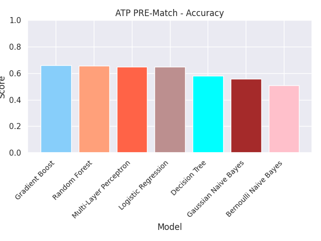
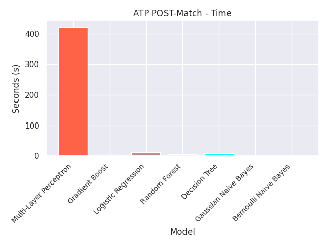

# Historical Tennis Match Predictions - Machine Learning Data Pipeline
Demonstrating the ability to automate ETL processes in AWS utilizing EC2, S3 and Airflow.

## Objective
The goal of the project is to examine different Machine Learning Models and their effectiveness in predicting ATP (Men's) and WTA (Women's) match results.  Models will be created both from player data pre-match as well as from data after match completed.  This will provide insight into whether tennis match results can be predicted based on players rankings and biometrics (pre-match data) or if in-match performance (post-match data) regardless of player ranking has a greater affect on being able to predict match results.  Included in the predictions will be feature importance from the dataset.  This will help determine what metrics within the match have the highest impact on whether a player will win or not.  This will help any tennis player whether amateur or professional determine what aspects they should focus on in training to increase their likelihood of winning.

## Dataset
Historical Match data will be ingested from [Jeff Sackmann's](https://github.com/JeffSackmann) github repository.  The schema for both [ATP](https://github.com/JeffSackmann/tennis_atp) and [WTA](https://github.com/JeffSackmann/tennis_wta) data is the same, providing for singular pre-processing steps for both Men and Women's matches.  The table schema and explanation of data represented in each column can be seen [here](https://github.com/JeffSackmann/tennis_atp/blob/master/matches_data_dictionary.txt).

### Pre-Processing
Machine Learning Models require training and test data to be input in a form with no null values and all numeric values.  The following pre-processing steps fromatted the dataset in the proper format.

**Dropping Columns**

The distinction between post-match and pre-match data was executed by removing specific columns from the dataset for each prediction case.  The data schema was manually reviewed and it was determined which values were irrelevant to both pre and post-match predictions.  Match data including aces, double faults, service points, service games etc were removed from the pre-match prediction data.  Also, columns where the winner could easily be determined from the match were dropped from post match data as well as pre match data.  These include break point faced and 1st serve points won.  The player that loses always faces more break points and the player that wins more 1st serve points always wins.  The model would not be representative in their predictions and would be too biased.

>**Irrelevant columns dropped from both pre and post match data:**
>
>tourney_id', 'tourney_name', 'tourney_date', 'tourney_level', 'match_num', 'winner_name', 'loser_name', 'winner_entry', 'winner_seed', 'winner_ioc', 'loser_ioc', 'loser_seed', 'loser_entry', 'score', 'loser_rank', 'winner_rank'

>**Post Match columns dropped causing bias in model predictions (not included in either dataset):**
>
>'l_bpFaced', 'w_bpFaced', 'w_1stWon', 'l_1stWon'

>**Columns dropped from post match only:**
>
>'winner_rank_points',  'loser_rank_points'

>**Columns dropped from pre match only (post match data):**
>
>'minutes', 'w_ace', 'w_df', 'w_svpt', 'w_1stIn','w_2ndWon', 'w_SvGms', 'w_bpSaved', 'l_ace', 'l_df', 'l_svpt', 'l_1stIn', 'l_2ndWon', 'l_SvGms', 'l_bpSaved'

**Handling Null Values**

Machine Learning Models cannot have any Null Values.  Rows with null values were dropped from the entire dataset except for biometric data (height and age) in which imputation was performed.  Null values for these columns were replaced with the average over the entire dataset.

**Removing Winner and Loser**

All the columns in the dataset are already based on the outcome of the match, winner and loser.  This is what is trying to be predicted.  It is not an acceptable format for our models and needs to be changed.  To account for this glaring issue, a random set of indexes was selected from 50% of the dataset.  New columns player 0 and player 1 were created for each of the winner and loser variables.  For the 50% of random indexes, Winner column values were copied over to player 0 column values and loser values were copied over to player 1 columns.  A new match winner column was created and assigned a value of 0 representing player 0 was the winner. For the indexes not selected randomly, the opposite was done.  Winner column values were copied to player 1 columns.  Loser column values were copied to player 0 and the match winner values entered is now 1 as player 1 is now the winner for the 50% of data indexes.  The tables below show the implementation of this method in a small subset of data.

** Note Schema Not Representative of actual data set schema.  For demonstration purposes only.

| Index | Winner         | Winner_Ace | Winner_DF | Loser              | Loser_Ace | Loser_DF |
|-------|----------------|------------|-----------|--------------------|-----------|----------|
| 1     | Janik Sinner   | 12         | 15        | Ben Shelton        | 13        | 25       |
| 2     | Novak Djokovic | 23         | 8         | Daniil Medvedev    | 12        | 18       |
| 3     | Carlos Alcaraz | 18         | 6         | Stefanos Tsitsipas | 16        | 12       |
| 4     | Tommy Paul     | 19         | 8         | Taylor Fritz       | 8         | 19       |
| 5     | Casper Ruud    | 18         | 10        | Alexander Zverev   | 11        | 21       |
| 6     | Andrey Rublev  | 21         | 20        | Frances Tiafoe     | 5         | 23       |

Indexes 2, 3 and 6 were randomly selected to assign winner values to player 0 and loser values to player 1 resulting in:

| Index | Player_0       | Player_0_Ace | Player_0_DF | Player_1           | Player_1_Ace | Player_1_DF | Match_Winner |
|-------|----------------|--------------|-------------|--------------------|--------------|-------------|--------------|
| 2     | Novak Djokovic | 23           | 8           | Daniil Medvedev    | 12           | 18          | 0            |
| 3     | Carlos Alcaraz | 18           | 6           | Stefanos Tsitsipas | 16           | 12          | 0            |
| 6     | Andrey Rublev  | 21           | 20          | Frances Tiafoe     | 5            | 23          | 0            |

The remaining indexes 1, 4, and 5 assigned winner values to player 1 and loser values to player 0.

| Index | Player_0         | Player_0_Ace | Player_0_DF | Player_1     | Player_1_Ace | Player_1_DF | Match_Winner |
|-------|------------------|--------------|-------------|--------------|--------------|-------------|--------------|
| 1     | Ben Shelton      | 13           | 25          | Janik Sinner | 12           | 15          | 1            |
| 4     | Taylor Fritz     | 8            | 19          | Tommy Paul   | 19           | 8           | 1            |
| 5     | Alexander Zverev | 11           | 21          | Casper Ruud  | 18           | 10          | 1            |

This now creates a perfectly balanced final data set with a random organization of player 1 winners and player 0 winners.  There is no bias between player 1 winners and player 0 winners.

| Index | Player_0         | Player_0_Ace | Player_0_DF | Player_1           | Player_1_Ace | Player_1_DF | Match_Winner |
|-------|------------------|--------------|-------------|--------------------|--------------|-------------|--------------|
| 1     | Ben Shelton      | 13           | 25          | Janik Sinner       | 12           | 15          | 1            |
| 2     | Novak Djokovic   | 23           | 8           | Daniil Medvedev    | 12           | 18          | 0            |
| 3     | Carlos Alcaraz   | 18           | 6           | Stefanos Tsitsipas | 16           | 12          | 0            |
| 4     | Taylor Fritz     | 8            | 19          | Tommy Paul         | 19           | 8           | 1            |
| 5     | Alexander Zverev | 11           | 21          | Casper Ruud        | 18           | 10          | 1            |
| 6     | Andrey Rublev    | 21           | 20          | Frances Tiafoe     | 5            | 23          | 0            |

**One-Hot Encoding**

One-Hot Encoding was performed on all columns that have non-numeric values to ensure the data passed into models only has numeric values.
>Columns that were One-Hot Encoded:
>
>'surface', 'draw_size', 'p0_hand', 'p1_hand', 'round'

## Model Building
The Machine Learning problem is a binary classification problem where the prediction is trying to identify the match winner.  Either Player 0 or Player 1.  There a multiple classification models that can be examined to help find which model is best and find the best.  The following classification models were selected to inspect prediction results and find the most accurate model.
<ol>
  <li>Multi-Layer Perceptron (Neural Network)</li>
  <li>Logistice Regression</li>
  <li>Random Forest</li>
  <li>Decision Tree</li>
  <li>Gaussian Naive Bayes</li>
  <li>Bernoulli Naive Bayes</li>
</ol>

### Model Metrics
The six machine learning models are ready to be trained with the tennis data.  The data is separated from its features and target (match_winner) variables.  The features data is normalized using sci-kit learn minMaxScaler so all feature values are in the same range and prevent any feature biases being created based on ranges of values in a feature.   Larger scales in a feature have the ability to introduce a bias when training a model.  Using minMaxScaler prevents this.

K-Fold Cross Validation was then used on each of the datasets and each of the models using 5 splits.  This provides an accurate represenation of the data using different portions of the data set.  Averaging the results of the model metrics (accuracy, precision, recall, F1) we can see the overall prediction results and see which models are most accurate.  Pre and Post match data can also be compared as seen below.  All metric plots and comparison plots can be found in the [Outputs](https://github.com/timsj12/Tennis_Match_Predictions/tree/master/Outputs) section of this repo under their appropriate tour and directory.

**ATP Model Accuracy Comparison**

**ATP Model Time Comparison**

### Final Model Predictions
Once each model is evaluated and overall metrics averaged the efficacy of each model is known and the final model can be trained and utilized using the entire dataset.  5% of the datasets were selected as the test portion and the rest were utilized for training.  Each model was again fit and the results were output in a confusion matrices which can be seen in the /Models/Visualization directories in the Output directory for each of the tours.  

The confusion matrix confirms the results of the K-Fold metrics generated and the actual numbero of predicted and actual values for each model can be seen.

**ATP Pre-Match Multi-Layer Perceptron (Neural Network)**

**ATP Pre-Match Gaussian Naive Bayes**

**ATP Pre-Match Most Important Features (Random Forest Generated)**

**ATP Post-Match Most Important Features (Random Forest Generated)**

